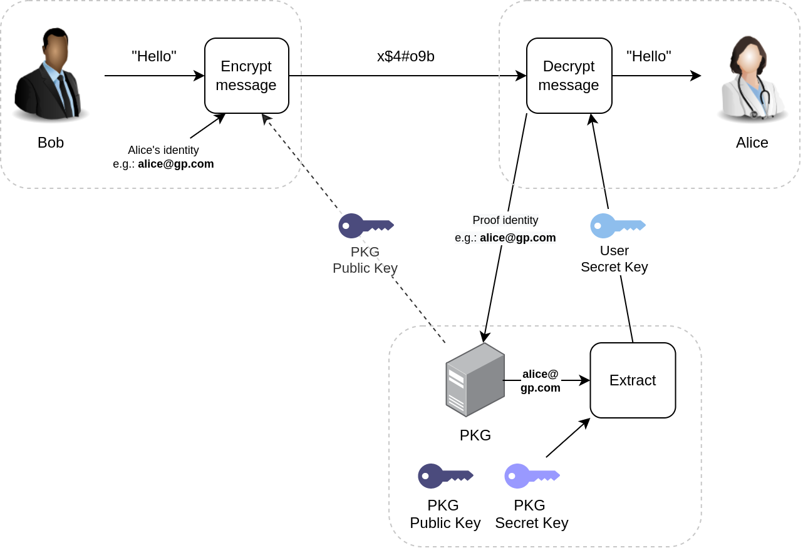

# IRMAseal

IRMAseal is an Identity-Based Encryption (IBE) service that can be used to
encrypt messages. In identity-based encryption, anyone can encrypt messages for
one another. Instead of a public key, the sender only requires the (static)
master public key and an identity of the recipient. In order to decrypt, the
receiver proves against a Trusted Third Party (TTP) that he/she has this
identity. Upon succesfully doing so, the receiver obtains a key that can be
used to decrypt the message.

  

IRMAseal uses [IRMA](https://irma.app), a privacy-friendly identity platform,
to authenticate these identities. These identities are stored on the users
phone in the IRMA app in the form of uniquely identifying attributes. These
attributes can freely and selectively be disclosed by the user to any party,
but only with explicit consent of the user.

## About this repository

This repository is the home of the core code for the IRMAseal service. Code
belonging to IRMAseal clients for mail client are not included in this
repository.

The repository consists of a workspace with four members:

- `irmaseal-core`: the core library. The core library's functionality includes:

  - Managing metadata containing required data for key decapsulation, including
    (compact binary) serialization.
  - Serialization of all artifacts that are sent over the
    network/stored to disk (e.g., public keys, user secret keys, ciphertexts,
    etc.).
  - A streaming encryption interface (under the `stream` feature) with an
    efficient web back-end (levering the `WebCrypto` API), see `wasm_stream`
    feature.

     

- `irmaseal-pkg`: an HTTP API server written in `actix-web` that runs an
  instance of a Private Key Generator (PKG).

- `irmaseal-wasm-bindings`: a library that generates Web Assembly bindings
  (using `wasm-pack`) that allows interfacing with the core library in web
  applications.

- `irmaseal-cli`: a command-line (client) interface that encrypts and decrypts
  files.

## Relation to IRMA

IRMAseal is developed independently of IRMA, but has a heavy dependency on IRMA
for the attestation of ones identity. IRMAseal however was thought up by the
maintainers of IRMA (Privacy by Design Foundation).

## Funding

Development of IRMAseal was initially funded by the Next Generation Internet
initiative (NGI0) and NLnet. The project is currently funded by a 4-year
project from NWO under the name "Encryption 4 All".
