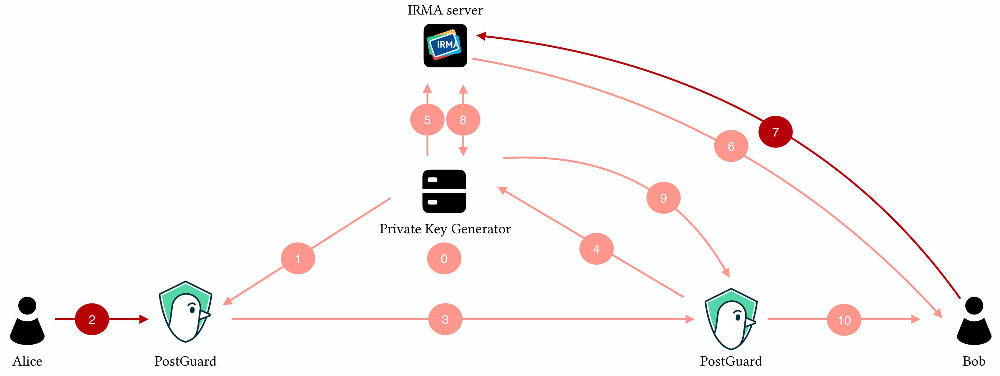

# 

⚠️ **Warning**: This implementation has not been audited. Use at your own risk!

PostGuard is an Identity-Based Encryption (IBE) service that can be used to
encrypt messages. In Identity-Based Encryption, anyone can encrypt messages for
one another. Instead of a public key, the sender only requires the master
public key and an identity of the recipient. In order to decrypt, the receiver
proves against a Private Key Generator (PKG) - a trusted third party - that he
is indeed the correct recipient. Upon succesfully doing so, the receiver
obtains a key that can be used to decrypt the message.

### About this repository

The repository consists of a workspace with four members:

| crate/package | description                                                                                                                                                                                                                                                                                                                                                                                                                                                                                                      |
| ------------- | -----------------------------------------------------------------------------------------------------------------------------------------------------------------------------------------------------------------------------------------------------------------------------------------------------------------------------------------------------------------------------------------------------------------------------------------------------------------------------------------------------------      |
| `pg-core`     | The core library. The core library's functionality includes: <ul><li>Managing metadata containing required data for key decapsulation, including (compact binary) serialization.</li><li>Serialization of all artifacts that are sent over the network/stored to disk (e.g., public keys, user secret keys, ciphertexts, etc.).</li><li> A streaming encryption interface (under the `stream` feature) with an efficient web back-end (levering the `WebCrypto` API), see `web` and `stream` feature. </li></ul> |
| `pg-pkg`      | An HTTP API server written in `actix-web` that runs an instance of a Private Key Generator (PKG).                                                                                                                                                                                                                                                                                                                                                                                                                |
| `pg-wasm`     | A library that generates Web Assembly bindings (using `wasm-pack`) that allows interfacing with the core library in web applications.                                                                                                                                                                                                                                                                                                                                                                            |
| `pg-cli`      | A command-line (client) utility that encrypts and decrypts files.                                                                                                                                                                                                                                                                                                                                                                                                                                                |

### Authentication providers

PostGuard uses [IRMA](https://irma.app), a privacy-friendly identity platform,
to authenticate these identities. These identities are stored on the users
phone in the IRMA app in the form of uniquely identifying attributes. These
attributes can freely and selectively be disclosed by the user to any party,
but only with explicit consent of the user. Eventhough PostGuard uses IRMA,
other authentication modules could easily be intregrated.

### Session flow

A typical PostGuard session can be depicted as follows. The red actions require
user interaction. All other actions are automatic.

  

<ol start="0">
  <li>The PKG generates a public/private master key pair.</li>
  <li>Alice's client retrieves the public master key from the PKG.</li>
  <li>Alice uses the public master key and Bob's identity to encrypt a message.</li>
  <li>Alice's client sends the ciphertext to Bob via a possibly untrusted channel/cloud storage.</li>
  <li>Bob's client asks for a key to decrypt the ciphertext.</li>
  <li>The PKG starts an authentication session at the IRMA server.</li>
  <li>Bob is asked to reveal his identity, using a QR code.</li>
  <li>Bob reveals his identity.</li>
  <li>The IRMA server sends the authentication results to the PKG.</li>
  <li>The PKG issues a key for Bob's identity.</li>
  <li>Bob's client decrypts the ciphertext using his just obtained key.</li>
</ol>

### Funding

Development of PostGuard was initially funded by the Next Generation Internet
initiative (NGI0) and NLnet. The project is currently funded by a 4-year
project from NWO under the name "Encryption 4 All".
