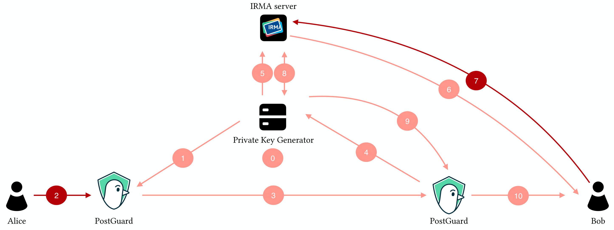

# <p align="center"></p>

> For full documentation, visit [docs.postguard.eu](https://docs.postguard.eu/repos/postguard).

PostGuard is an Identity-Based Encryption (IBE) service for encrypting messages and files. Instead of exchanging public keys, senders only need the recipient's identity (such as an email address) and the system's master public key. Recipients prove their identity to a Private Key Generator (PKG) to obtain a decryption key.

PostGuard uses [Yivi](https://yivi.app), a privacy-friendly identity platform, for identity authentication. This repository contains the core protocol library, the PKG server, WASM bindings, a CLI tool, and FFI bindings. All other PostGuard tools and SDKs depend on this.

### Workspace

| Crate/package | Description |
| ------------- | ----------- |
| `pg-core` | Core IBE library. Manages encryption metadata, serialization of keys and ciphertexts, and provides a streaming encryption interface with an efficient WASM backend (using the WebCrypto API). |
| `pg-pkg` | HTTP API server (actix-web) that runs a Private Key Generator (PKG) instance. |
| `pg-wasm` | WebAssembly bindings (via wasm-pack) for using the core library in web applications. |
| `pg-cli` | Command-line tool for encrypting and decrypting files. |
| `pg-ffi` | Foreign function interface bindings for calling pg-core from other languages (C, C#, etc.). |

### Session flow

A typical PostGuard session works as follows. Red actions require user interaction; all other actions are automatic.

<p align="center">
  
</p>

0. The PKG generates a master key pair.
1. Alice's client retrieves the public master key from the PKG.
2. Alice uses the public master key and Bob's identity to encrypt a message.
3. Alice's client sends the ciphertext to Bob via any channel.
4. Bob's client asks for a key to decrypt the ciphertext.
5. The PKG starts an authentication session at the Yivi server.
6. Bob is asked to reveal his identity via a QR code.
7. Bob reveals his identity.
8. The Yivi server sends the authentication results to the PKG.
9. The PKG issues a key for Bob's identity.
10. Bob's client decrypts the ciphertext using his key.

## Development

Install Rust and Cargo:

```bash
curl https://sh.rustup.rs -sSf | sh
```

Build the workspace:

```bash
cargo build --release
```

Run the tests:

```bash
cargo test
```

## Releasing

Releases are automated with [release-plz](https://release-plz.ieni.dev/). When changes land on `main`, release-plz opens a release PR. Merging that PR publishes to:

- **crates.io** (pg-core, pg-cli, pg-pkg, pg-ffi)
- **npm** (pg-wasm)
- **Docker Hub** (pg-pkg)
- **GitHub Releases** (FFI native libraries)

## License

MIT
