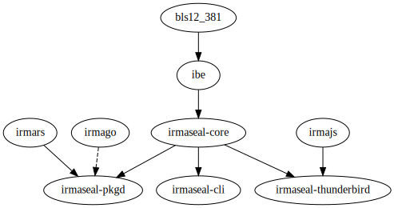
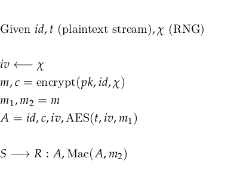
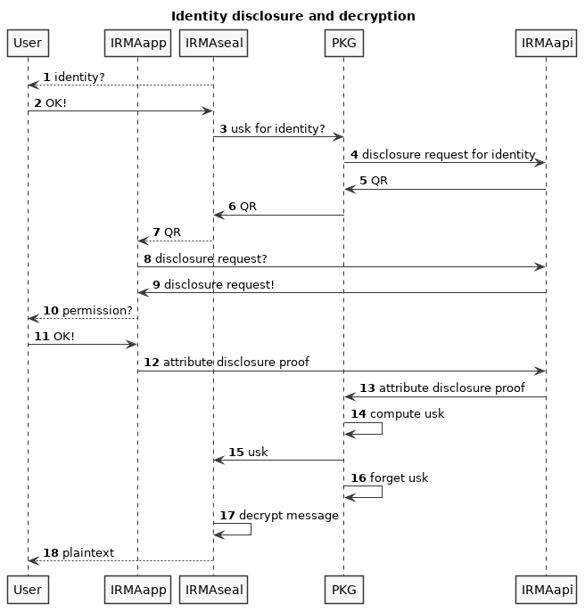
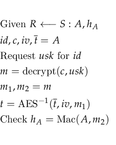

# IRMAseal technical overview

IRMAseal is an Identity Based Encryption (IBE) service that can be used to encrypt messages for ones identity. IRMAseal uses IRMA, a privacy-friendly identity platform, to authenticate these identies. These identities are stored on the users phone in the IRMA app in the form of uniquely identifying attributes. These attributes can be freely disclosed by the user to any party, but only with explicit consent of the user.

Messages in the context of IBE may pertain to e-mail messages, attachments or files, and the identity pertains to any single identifying IRMA attribute. For example these attributes can be an e-mail address, BSN or phonenumber.

The target audience of IRMAseal is anyone that can use IRMA, but a user also needs to grasp the concept of encryption. IRMA can be used by anyone that can use authorisation systems. Examples of these systems are apps used for banking, which are already used by most of the Dutch population.

For this Proof of Concept we focus on the sending and receiving of encrypted e-mail, possibly restricted to users with a `.nl` e-mail address. This may need to be restricted because the IRMAseal infrastructure thusfar will be hosted by dutch parties. An international project will require international parties to support it, or else adoption will probably be limited.

In this document we first sketch the basic setup, and later specify improvements to attain further desired cryptographic or security properties. For the Proof of Concept this basic setup should suffice to demonstrate viability of the service, and these improvements may be implemented at a later date.

This document is meant for:

* product owners to preview where the project is headed.
* cryptographers to peer-review the design.
* implementators, for which this document acts as a guideline. It is **not** an exact specification, whilst we try to approximate this level of details as best we can given that everything is not yet implemented and set in stone.

## Reason for existence
IRMAseal is based on Identity Based Encryption (IBE). With IBE, a single global keypair exists which is owned by a trusted third party (TTP). Users can derive any public key from this global TTP public key. Private keys can be extracted by the TTP. As this is the sole function of the TTP, it is also called the Private Key Generator (PKG). In literature the TTP / PKG is also called the Key Generation Server (KGS). Henceforth we will name this TTP exclusively the PKG. A user needs to authenticate itself with the PKG in order to receive their private key. In IRMAseal this authentication is done with IRMA by providing the PKG with an attribute disclosure proof for the identity to which the private key corresponds.

Compared to standard assymmetric encryption as used in systems such as PGP (Pretty Good Privacy), IBE has two advantages:

1.
    A user can encrypt messages by deriving the public key for any identity, whilst the private key need not even have been generated. The recipient can leisurely install the required software and retrieve the private key at any later date. With PGP one can only start sending encrypted messages once the recipient has generated a keypair and a keysigning-meeting is held. This problem stiffles PGP adoption. Note that a lot of users of PGP do not actually verify (or sign) the keys of other parties. Instead they trust the keys on first use (TOFU), by either trusting in the *web of trust*, or trusting that users detect malicious keys on the keyservers. This is arguably a significant usability and security issue of PGP.
2.
    In PGP most public keys are initially retrieved from keyservers. The sender thus leaks the identity of their communication-partner to the keyservers. With IBE, the public key of the recipient can be derived from a global public key, and thus the identity of the recipient is not disclosed to the central architecture. Naturally the e-mail infrastructure still needs to know where to deliver the message.

However their are also three downsides to using IBE compared to using PGP:

1.
    There needs to be a trusted third party which needs to be able to generate any user secret key. Thus once this party is compromised, all the user secret keys are compromised. We propose a mitigation for this risk in the *Improvements* section.
2.
    The trusted third party is required to remain accessible, or else users will not be able to retrieve user secret keys and will thus be unable to read their messages. If this party is unable to generate these keys, for example because the global private key is compromised or unavailable, all previous messages are no longer readable. Extreme care must be taken to prevent service downtime.
    For this reason we are considering to limit this service to encryption-in-transit, i.e. that messages in encrypted format are only decryptable within a relatively short timespan and should be stored unencrypted after receiving the message. This reduces the IRMAseal burden of keeping legacy versions of the software and services around in perpetuity. This is still a matter for debate.
3.
    As a counterpoint to the first benefit, it is possible for people to receive encrypted e-mail messages without having a clue what to do with these encrypted unaccessible messages. A receiver can sort this out by contacting the sender and requesting support. We can also provide alternative messages if the IRMAseal format is not recognized by the e-mail client detailing how the system can be used (as specified in the `multipart/encrypted` standard). Whichever solution we choose, it will remain an hurdle for usability.

Furthermore a general downside of IBE is that the underlying cryptographic techniques required to implement IBE are (thus far) not secure against quantum computer attacks.

## Compared to end-to-end-encryption
Note that IBE is not a form of end-to-end-encryption, as the private key is known to the trusted third party. Ideally one would like to use end-to-end-encryption algorithms such as Axolotl, but this is difficult for e-mail as e-mail (or the underlying SMTP protocol) is not a bi-directional real-time communication channel with the receiver. Also the above benefits not applicable to end-to-end-encryption in general. Thus for unidirectional slow channels such as e-mail IBE is more suited.

# Participants
The following actors are required for the use of IRMAseal:

* **Private Key Generator (PKG)**: IRMAseal server daemon that generates user secret keys on demand. Also acts as an IRMA verifier as it receives IRMA attribute disclosure proofs.
* **IRMAseal client**: either a plugin for an e-mail application or a stand-alone commandline application. This client facilitates the encryption and decryption of messages, as well as deriving *User Public Keys* and fetching *User Secret Keys* from the *Private Key Generator*.
* **E-mail client**: an application such as Mozilla Thunderbird that manages the reading, sending and receiving of a persons e-mail. The IRMAseal client needs to integrate with this application such that the e-mails can be encrypted and decrypted.
* **IRMA issuer**: a party wanting to issue identity attributes to someone. The issuer vouches for the identity of this party. In the case of e-mail this issuer can verify the ownership by sending a verification e-mail. (note: this is a weak verification method that depends on the confidentiality of the mail transport, that which IRMAseal specifically aims to provide) In the case of BSN this is done by the municipality of Nijmegen by requiring citizens to log in using DigID.
* **IRMA app on phone**: application that manages attributes and can disclose them to the *Private Key Generator*.

# Cryptographic artifacts
The service needs certain artifacts that are communicated between the above participants. The following artifacts are provided by IRMA:

* **Attribute as proof of identity**: an IRMA attribute that proves the holder to have a certain identity.
* **Attribute disclosure proof**: a set of disclosed IRMA attributes, along with a proof of knowledge showing that these disclosed attributes originated from a valid issuer.

The following artifacts will be provided by IRMAseal:

*
    **Identity**: a string pertaining to the supposed identity of a person. In our case this is an IRMA attribute with a type and possibly a value, combined with the timeframe for which this identity is valid. This timeframe is useful for three things:
    * It will limit the validity of the identity, providing *forward secrecy* in case key material is stolen. A message sent at a later date can not be decrypted by an identity with an older timeframe.
    * It will enable caching key material for a set time duration. This will improve usability, as only once in a timeframe an IRMA attribute disclosure needs to occur.
    * It will enable sending messages into the future, only allowing decryption once the timeframe has occurred.

    The validity of the timeframe will be checked and enforced by the PKG and will result in the PKG not disclosing the user secret key when the timeframe lies in the future. Thus with this *past-and-current* policy only user secret keys dated for the past will be disclosed.
    
    Inversely a *current-and-future* policy could be envisioned where the PKG will not disclose a user secret once a certain moment has passed. This however only yields a *soft guarantee* as older user secret keys can be stored once disclosed. It also does not provide *forward secrecy*. We have chosen not to implement this alternate policy, and only implement the policy where past and current keys can be disclosed.

    An example of an identity is:
    * Type: `pbdf.pbdf.email.email`
    * Value: `w.geraedts@sarif.nl`
    * Timeframe: 2019-09-17 from 00:00:00 UTC to 23:59:59 UTC

    Note that we only need to represent the start of the timeframe, as the duration of this frame is captured in the public generator parameters. From this the end of the timeframe follows.
*
    **Parameters**: current configuration of the service. Includes the current protocol version to prevent the use of deprecated clients, and thus prevent that encrypted messages can no longer be decrypted. Also includes protocol parameters such as the maximum age of an identity to determine their validity timeframe.

    An example of these public parameters is:
    ```json
    {
        "format_version": 0,
        "max_age": 300,
        "public_key": "..."
    }
    ```
* **Global public key**: a random key *generated* by the *Private Key Generator*. This key may be used by any party to derive user public keys. Such a public key should have an expiration date, to enable graceful migration to new keys.
* **Global secret key**: a random key *generated* by the *Private Key Generator* that should be kept a secret to any other party. This key can be used to extract user secret keys for any given identity. Note that the terms *private* and *secret* are used interchangeably, but that the term *secret* is preferred.
* **User public key**: the key directly *derived* from an identity, which can be used together with the global public key to encrypt a message for that identity. This derivation is used internally, and thus the user public key is not an artifact that can be retrieved and used outside of the IBE operations. Instead, all relevant operations use the *identity* directly.
* **User secret key**: a key extracted from the global secret key, and an identity. Initially *extracted* by the *Private Key Generator* and transmitted to the user once a proof of identity is presented.
* **Session key**: a random symmetric key that can be used to drive more canonical symmetric encryption such as AES (Advanced Encryption Standard or Rijndael). Any file or e-mail message can be encrypted using this key. In our chosen IBE scheme this key is called the *symmetric key*. In IBE in general this symmetric key is called the *message*, but as we also have the concept of an *e-mail message* in IRMAseal, we will refer to this IBE concept as the *session key*. The session key is encrypted with IBE using the user public key, but should remain private to the sender until then. Once decrypted it is known to the receiver too.
* **Ciphertext**: the session key that has been encrypted using IBE. Can be decrypted using the corresponding user secret key. This ciphertext is attached to the AES encrypted e-mail or file and can thus be public.

## IBE operations
In the previous list of artifacts some explicit operations are named that are specific to the concept of IBE. The following IBE operations exist:

* **Generate**: create a random global public key and corresponding global secret key.
* **Derive** (internal operation): compute a user public key from a global public key and an identity.
* **Extract**: compute a user secret key from a global private key and an identity.
* **Encrypt**: encrypt a session key (also called IBE message) using a global public key and identity.
* **Decrypt**: decrypt a ciphertext to a session key using a user secret key.

# Proof of Concept software deliverables
The following software projects will be delivered as part of this Proof of Concept:

* General libraries
* Public Key Generator (PKG) daemon
* Command line application
* Thunderbird plugin
* *(optional) Browser plugin (WebExtension) for web e-mail clients like GMail and Outlook 365*

The browser plugin may be of limited use if the scope of the Proof of Concept is limited to dutch `.nl` domains. It might still be beneficial as a demonstrator.

# Technical choices
At its core IRMAseal needs an Identity Based Encryption (IBE) scheme. Using this scheme a session key is encrypted, and this session key is used to encrypt the real payload of a file or an e-mail message using AES. This scheme operates on an elliptic curve. All this software needs to be implemented in a language and run in a context. We will briefly argue our choices in these matters:

## IBE scheme
There are several IBE schemes available. Because IRMAseal leads up to a bigger project for Attribute Based Encrypted (ABE), we require a scheme that depends on pairing-based elliptic curves. Throughout this overview we will not discuss ABE further. Suffice to say we need pairing-based elliptic curves.

We would also like to use a scheme that provides the best available security properties. Most of these schemes are *selectively secure*. The Waters scheme is provable *fully* secure in the standard model. However this Waters scheme is not secure against Chosen Ciphertext Attacks (CCA). In order to attain security against CCA's we can use the [Kiltz-Vahlis IBE1 scheme](https://link.springer.com/chapter/10.1007/978-3-540-79263-5_14), which is inspired by the Waters scheme, but improves on it. For more information on the security properties these schemes provide we refer to their original publications.

The choice of the scheme is also dependent on the performance of the underlying elliptic curve, the underlying pairing, and the size of the public key, private key and ciphertexts. Suffice to say that these are all acceptable. Because we use a so-called *type-3* pairing, which goes from `G1 x G2 -> Gt` instead of `G x G -> G1`, we also have some freedom in choosing which group is used where in the scheme. We will not go into these considerations in this technical overview.

## Elliptic curve
Our Kiltz-Vahlis IBE1 scheme requires a pairing-based elliptic curve that is performant and secure. Currently it is contested which curve is good enough. For example relatively recently the [BN256 curve got its security level degraded](https://moderncrypto.org/mail-archive/curves/2016/000740.html). We are in discussion with relevant experts on which curve is good enough. For now our intermediate conclusion is that the [BLS12-381](https://github.com/zkcrypto/bls12_381) curve is sufficiently secure, whilst also performant. For our Proof of Concept we will operate on this conclusion. This elliptic curve provides *type-3* pairings, as desired.

## Implementation language
Our choice for implementation language is bound by the deliverable of a working Thunderbird plugin. The plugin system for Thunderbird runs in XULrunner, which is a javascript engine derived from that used in the browser Firefox. Whilst it is possible in this context to run native applications (this is how the Enigmail PGP plugin operates), it is more ergonomic for the maintainers of IRMAseal to deliver a pure Javascript plugin. Also this is required for the optional deliverable of a Chromium plugin. Thus our Proof of Concept implementation must either be written in Javascript, or be transpiled to Javascript (or WebAssembly).

Ideally we would like our implementation to be in a modern, secure and performant language. Most of the IRMA software is written in Go. However, because there exists no implementation of the BLS-12-381 curve in Go yet, and because there does exist such a constant time [implementation in the language Rust](https://github.com/zkcrypto/bls12_381), we've chosen to implement all core software in Rust. Transpilation to Javascript and WebAssembly is supported by the Rust compiler.

Excluded from this is the code associated with the specific Thunderbird plugin UI and networking code. These API's are exposed as Javascript API's, and it would be unergonomic to first expose these API's directly in Rust.

## Feasibility
In order to test the hypotheses that these implementation choices would actually be performant, even when compiling to Javascript (asmjs) or WebAssembly, we've implemented the Kiltz-Vahlis IBE1 scheme in Rust. All operations in this implementation run within tens of milliseconds natively, and within hunderds of milliseconds in a javascript context. The precise performance characteristics are for this overview not relevant. It is sufficient to note that the runtime performance is within acceptable bounds. Thus we conclude that this approach is feasible. There are several avenues for improving the performance of the upstream elliptic curve library. However for this Proof of Concept we leave this as an exercise for a later date.

# Software projects
All subsequent projects are yet to be developed, unless otherwise stated. The Thunderbird and browser plugins require integration with IRMA clientside, which is typically in Javascript as the network API's are also in Javascript. For the *Private Key Generator* this implementation needs to be in native Rust.

* [bls12_381](https://github.com/zkcrypto/bls12_381): the used pairing-friendly elliptic curve (third party)
* [ibe](https://github.com/wassasin/ibe): implementation of the Identity Based Encryption Kiltz-Vahlis IBE1 scheme in Rust, amongst other schemes.
* irmaseal-core: library with all IRMAseal operations such as encryption and key generation, excluding consuming of IRMA attribute disclosure proofs.
* [irmars](https://github.com/wassasin/irmars): client implementation of a service provider server in Rust, enabling the consumption of an attribute disclosure proof.
* [irmajs](https://github.com/privacybydesign/irmajs): client implementation of the IRMA protocol in Javascript. (already existing)
* irmaseal-cli: command-line application that serves all IRMAseal operations, including IRMA attribute disclosure proofs.
* irmaseal-pkgd: the *Private Key Generator*, an HTTP REST service that receives attribute disclosure proofs and yields the corresponding user secret key. This is an actual daemon, along with instructions on how to run it in production.
* [irmago](https://github.com/privacybydesign/irmago): specifically `irma server` which will act as the service which with the IRMA apps will communicate.  It handles all IRMA-specific cryptographic details of verifying IRMA attributes with an IRMA app on behalf of `irmaseal-pkgd`. (already existing)
* irmaseal-thunderbird: javascript plugin in Thunderbird enabling encryption and decryption of e-mail.

These projects depend on each other in the following manner.


# Processes

## PKG initialisation (by PKG)
Initially the PKG needs to generate a public-/private- keypair.
For this we use the Kiltz-Vahlis IBE1 `setup` method.
```
(pk, sk) = setup(RNG)
```
These are stored on disk. In a later phase we can store the secret key (SK) only in a smartcard. We also configure a set of `parameters`.

## Encrypt a file / bytestream
An arbitrary bytestream *t* can be encrypted using an element *m* of the pairing group. Classically in an IBE scheme this element is chosen randomly and encrypted. However in Kiltz-Vahlis IBE1 this element is yielded as part of the `encrypt` operation, alongside its ciphertext *c*. Thus it performs probabilistic encryption, but does not implement encryption in the classical IBE sense.



We encode this random element as a 288 byte long stream. We digest this stream by computing a SHA3-512 hash from this stream. This hash is split into two 32 byte keys *m<sub>1</sub>* and *m<sub>2</sub>*. The first key *m<sub>1</sub>* is used for symmetric AES encryption. The second key *m<sub>2</sub>* is used for an HMAC. The ciphertext can also be encoded as a 144 byte long stream.

This encrypted bytestream of *t* and all the prerequisites to decrypt it are formatted as follows:

1. A tag reading `0x148A8EA7` (4 bytes)
2. 8 bit unsigned little endian number signifying the file format version. For this standard that is version `0x0`.
3. A 64 bit unsigned little endian number signifying the UTC timestamp (from) when the message can be read. It is the start of the timeframe for which the underlying identity is valid. Normally this should be the creation moment of the file, rounded down (as per modulus `max_age` of the public parameters) to the start of that timeframe.
4. An 8 bit unsigned little endian number signifying the length of the byte representation of the following value. This value is thus between the numbers 0 and 255.
5. An UTF-8 string signifying the IRMA attribute type for this identity. For example: `pbdf.pbdf.email.email`.
6. An 8 bit unsigned little endian number signifying the length of the byte representation of the following value. The value `0xFF` signifies that the following field has **no value**, as opposed to `0x00` which signifies that next value has length `0`. Thus values have length 0 to 254.
7. An **(optional)** UTF-8 string signifying the identity to which this bytestream was encrypted. This field is optional because some identity-types should not be disclosed in plaintext, such as the BSN. The receiver only has several attributes of a single type, thus not knowing which identity the message is for needs not to be a problem. For example, one only has a single BSN. For example: `w.geraedts@sarif.nl`.
8. The serialized Kiltz-Vahlis IBE1 ciphertext of 144 bytes.
9. The AES IV, which is a nonce of 16 bytes.
10. The encrypted ciphertext, encrypted using AES-256 in CFB mode using the key mentioned at the beginning of this section.
11. At the end a HMAC-SHA3-256 of the entire stream, including the tag, header, IV and ciphertext (parts 1 to 10). This HMAC is 32 bytes long. The HMAC key is created from the decrypted message / symmetric key as mentioned at the beginning of this section.

This formatting is designed such that it can be constructed and decrypted in a streaming fashion with minimal memory usage.

## Decrypt a file
From the identity hints in the encrypted file the user either already knows which attribute must be used, or can guess which attribute should be used. The user then issues an attribute disclosure proof to the *Private Key Generator*, to receive the user secret key. The *Private Key Generator* computes the user secret key in the following manner:

```
id = {
    "type": "pbdf.pbdf.email.email",
    "timeframe": 1566394100,
    "identity": "w.geraedts@sarif.nl"
}
usk = extract(pk, sk, id)
```
This user secret key is transmitted to the user when the user is verified by IRMA to have that attribute.



Having the user secret key, it is used to decrypt the Kiltz-Vahlis IBE1 ciphertext:
```
m = decrypt(c, usk)
```

The resulting Kiltz-Vahlis IBE1 message can be used to derive the AES key and HMAC verification code. This verification code should first be checked for integrity. Then the AES ciphertext can be decrypted:



## Encrypt an e-mail (by sender)
Encryption of an e-mail is not trivial because the e-mail representation standards are not trivial. An e-mail can be in a multipart MIME format, and each part could be encrypted or plaintext. This setup can be problematic, as demonstrated with the [EFAIL vulnerability](https://en.wikipedia.org/wiki/EFAIL).

All MIME multipart segments will be encrypted using the canonical [multipart/encrypted (rfc1874 section 2.2)](https://tools.ietf.org/html/rfc1847#section-2.2). In this format the protocol parameter value is "`application/irmaseal-encrypted`". Each segment can be treated as a bytestream to be encrypted per the previous section. As this segment contains all the required information to decrypt it again, we do not use the `multipart/encrypted` header segment. Instead, everything is placed in verbatim in the accompanying body bytestream:


```
From: Wouter Geraedts <w.geraedts@sarif.nl>
To: Wouter Geraedts <w.geraedts@sarif.nl>
Mime-Version: 1.0
Content-Type: multipart/encrypted; boundary=foo;
protocol="application/irmaseal-encrypted"

This is an IRMAseal/MIME encrypted message.
Visit https://irmaseal.org/mime for more information and/or
contact the sender of this message for more information.
--foo
Content-Type: application/irmaseal-encrypted

Version: 1

--foo
Content-Type: application/octet-stream

<bytestream encoding as per previous section, as base64>

--foo--
```

This bytestream can be text, HTML or an attachment. The plaintext IRMAseal text is intended for recipients that do not yet use the system. The link contained therein should point to a help page explaining IRMAseal, and guiding users on how to install the software, use IRMA and decrypt the message.

## Decrypt an e-mail (by receiver)
Decryption of an e-mail is analogous. `multipart/encrypted` specifies that rendering may begin after all encrypted parts are decrypted.

# Stateless PKG
To limit the complexity of IRMAseal, and to enable scalability and redundancy we would like to make the IRMAseal-pkgd stateless. We achieve this by deferring any state to either the client or the `irmago` server. How this is achieved is detailed in the next section.

Note that currently the `irmago` server is not yet scalable due to the lack of deferred state to a service such as Redis. Thus to achieve scalability for IRMAseal, we should adapt `irmago` to support this.

# IRMAseal protocol
All requests are prepended with a version in the path, to support migration between versions. Note that it is good practice to never support more than two versions of a protocol to force adoption.

For this standard all paths are prepended with `/v1/`.

## GET `/v1/parameters`

### Response
```json
{
    "format_version": 0,
    "max_age": 300,
    "public_key": "..."
}
```

The semantics of these fields is as follows:

* **Format version** is an indication which stream format version is the current valid one.
* **Max age** is the maximum age of a timeframe timestamp relative to the original message time, as indicated by the mailserver. This should be checked by an IRMAseal client and could indicate a malicious message when violated.
* **Public key** is the global public key as used by the Private Key Generator, in serialized base64 form.

## POST `/v1/request`
Request the user secret key for an identity. To facilitate this an IRMA session is started for this identity. Only the attribute part of the identity is relevant for this session, and not the timeframe.

### Request
```json
{
  "attribute": {
    "type": "pbdf.pbdf.email.email",
    "value": "w.geraedts@sarif.nl"
  }
}
```

### Response
Yields the token which can be used to resume the session, as well as a string that should be used to present as a QR-code to the user. This string is a JSON-object, but regardless should be passed as-is. The IRMAseal standard does not state any requirements for this string.

```json
{
    "qr": "{\"u\":\"...\",\"irmaqr\":\"disclosing\"}",
    "token": "..."
}
```

## GET `/v1/request/{token}/{timestamp}`
> Example: GET `/v1/request/RiAoxAPqxtxeWAaLYmAE/1568193478`

### Response 503 Service Unavailable
The upstream `irmago` server did not respond or responded with an unexpected response.

### Response 404 Not Found
The upstream `irmago` server did not find a corresponding IRMA session.

### Response 200 OK
The upstream `irmago` found the session corresponding to the *token*.
All responses of for this request look as follows:

```json
{
    "status": "<status>"
}
```

Status can be any of the following values:

* **INITIALIZED**: the IRMA session has been initialized.
* **CONNECTED**: the IRMA app has connected to the API server.
* **CANCELLED**: the IRMA session was cancelled.
* **DONE_INVALID**: the IRMA session was completed succesfully, but it did not contain a valid attribute disclosure proof.
* **DONE_VALID**: the IRMA session was completed succesfully, and it contains a valid attribute disclosure proof.
* **TIMEOUT**: The IRMA session has timed out.

In the case of the **DONE_VALID** status the user secret key is also supplied:

```json
{
    "status": "DONE_VALID",
    "key": "..."
}
```

# Thunderbird plugin Proof of Concept
A command-line application as well as a mail client plugin will be developed to enable usage of IRMAseal and to demonstrate the feasibility and usability of the system. The mail client plugin will be developed for [Thunderbird](https://www.thunderbird.net/), the e-mail client developed by Mozilla. This plugin will enable encryption and decryption of e-mail messages.

For the proof-of-concept the plugin does not store any identity or user secret key, and will thus not provide any key management. This restriction simplifies the interface quite a bit.

## Sending (encryption)
When sending an e-mail, the plugins asks whether it should be sent encrypted. If so, the user can choose between *for e-mailadress* (the address used for the e-mail, default) or for *other identity*. In the latter case, the user can enter an attribute type (i.e. e-mail address, phone number, BSN, etc. or a custom attribute type, and corresponding value). The system as detailed in this technical overview does not support sending a single e-mail to multiple identities. This support may be added at a later date.

The entire mail is then encrypted. Before sending the e-mail a warning is shown that decrypting the message will take considerable effort for the recipient if this recipient is not yet using IRMAseal, and confirmation is asked. 

A sent e-mail can not be read afterwards from the *sent folder*, as the mail itself is stored in its encrypted form, and the sender is almost always not a recipient. Note that as detailed earlier in this overview we are discussing only supporting encryption in-transit, and not in-rest. We have not reached a decision concerning this. In the case of encryption in-transit the e-mail is stored unencrypted in the sent folder.

## Receiving (decryption)
When receiving an IRMAseal message and when the software has not yet been installed, the following message is shown:

> This is an IRMAseal/MIME encrypted message.
> Visit https://irmaseal.org/mime for more information.

This message is contained in the plaintext part of the `multipart/encrypted` enveloppe and should be presented by all *Mime*-compatible e-mail clients.

Following the instructions on that (as of yet non-existent page) the software for a compatible mail client is installed. When viewing the message the following text and a button appear:

> This is an encrypted IRMAseal message for:
>
> E-mail address: w.geraedts@sarif.nl
>
> **\<Decrypt this message\>**

When clicking this button, the following screen appears:

> Please scan this QR-code with your IRMA app.

Assuming the user **has** the desired attribute, and reveals it, promptly the message is decrypted.

### Cancelling, invalid attribute etc.
If during the interactions the valid attribute was not disclosed, but perhaps the session timed out or was cancelled, this can immediately be shown in the interaction.

### Invalid timestamp request
The encrypted message contains an identity with a timeframe for which the identity is valid. When the e-mail is significantly newer (more than `max_age` from the public parameters), the e-mail might maliciously be using an old user public key. Thus IRMAseal should in that case not even present the option to decrypt the message, but instead show a warning:

> This is an encrypted IRMAseal message, but the message was dated older than
> the e-mail message is was contained in. This might indicate that this message
> was tampered with.
>
> You can request a new message from the original sender by replying.

### Invalid recipient address
The encrypted message contains an identity, but the e-mailaddress used need not correspond to the e-mailaddress of the person receiving the message.

This should be shown, but not prohibit the decryption of the message. There might be valid usecases for this to happen, such as when messages are forwarded, or when sent through a mailinglist.

> This is an encrypted IRMAseal message for:
>
> E-mail address: w.geraedts@sarif.nl
>
> **WARNING**: this address does not correspond to the address of the recipient.
>
> **\<Decrypt this message\>**

# Improvements
The following improvements will provide better security properties. However these improvements will probably not be implemented as part of the current project to develop a Proof-of-Concept.

## ConDisCon as identities
In our current design a singular attribute corresponds to a user keypair. It would also be possible to create IBE identities from IRMA ConDisCon objects. These objects contain **con**junctions of **dis**junctions of **conjunctions** of attributes. This would allow the encryption to for example 'citizen of the Netherlands' in combination with 'is 18 years or older' or 'citizen of France' in combination with 'is 21 years or older' as a single identity.

Note that this would require deterministic serialisation of ConDisCon objects, including proper ordering of attributes. This is not difficult, but should be standardized. Note that our single attribute trick to not disclose the attribute value within the encrypted bytestream would not be possible, as it should be somewhat likely to guess what the identity should be for any message.

This approach would enable *Attribute Based Encryption*-like functionality, whilst keeping the simplicity of the *Identity Based Encryption* implementation.

## Federation
One argument against IRMAseal could be that it has an intrinsicly centralised setup: every user is dependent on the same Trusted Third Party. This could be mitigated by allowing any Trusted Third Party by for example allowing DNS records to override which TTP should be used for a domain. One could check for `TXT` records that would point to a new IRMAseal PKG.

As we already are dependent on the security of HTTPS transport, there is no argument against trusting DNSsec or similar infrastructure for this.

## Distributed Trusted Third Parties
The facts that IRMAseal depends completely on the integrity of a single trusted third party is a major risk. This third party or a person responsible for it's infrastructure could relatively easily generate user secret keys maliciously. This risk can very will be a reason not to adopt IRMAseal.

One way to mitigate this risk is by having multiple Trusted Third Parties, of which at least a single one must be trusted for the user secret keys to be safe. This would work by having multiple global keypairs, and encrypting a message with derived user keys in a specific order. Decryption would work similarly. For classical IBE schemes this would be easy to implement. For Kiltz-Vahlis IBE1 this would involve generating new symmetric keys, serializing them, and encrypting them with AES in order. Perhaps some more natural way exists to do this with such a scheme as Kiltz-Vahlis IBE1, but this would need to be investigated.

Finally it also requires support for multiple simultaneous sessions in IRMA, otherwise it would require *n* times scanning a QR-code and revealing the same attribute for *n* Trusted Third Parties. This support would also need to be developed.

## Hardware Security Module
Currently all core IRMAseal software is written in so-called *core Rust*, which means that it does not use any system calls for it's functionality and is capable of running in non-Linux environments such as WebAssembly and embedded hardware. The memory usage and performance is also compatible with these execution contexts.

One huge boon for IRMAseal would be to completely disable the copying of the global private keys by running the Private Key Generator in a secure embedded context which does not support private key extraction. Such an hardware module would have to be attached to a server, which would handle the PKG API.

## Signing
In our current Proof of Concept we do not support signing of messages. This could be achieved using either the signing functionality of IRMA, or by transforming the IBE scheme using so-called *Waters Signatures*.

This signing could be very useful, most notably in our targetted medical environment.
