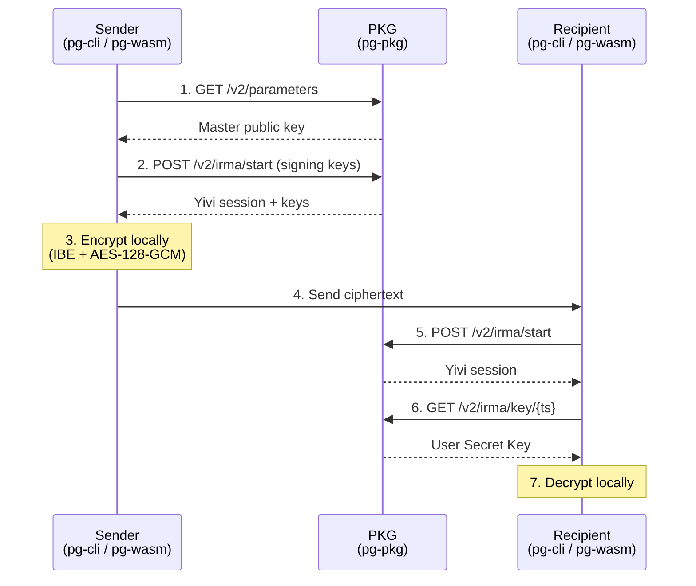

# Architecture Overview

PostGuard implements a **Sign-then-Encrypt (StE)** hybrid protocol combining Identity-Based Encryption (IBE) with Identity-Based Signatures (IBS) and symmetric encryption.

## Component Diagram



## Crate Responsibilities

### pg-core

The core cryptographic library. It provides:

- **Identity/Policy types** — `Attribute`, `Policy`, `EncryptionPolicy` that define recipient identities as conjunctions of Yivi attributes with a timestamp.
- **Header construction** — Multi-recipient KEM encapsulation that produces a single ciphertext header for all recipients.
- **Sealer/Unsealer** — High-level encryption and decryption API supporting both in-memory and streaming modes.
- **Artifact serialization** — Constant-time Base64 and binary encoding of all cryptographic objects.

pg-core supports two backends via feature flags:
- `rust` — Uses RustCrypto crates (default, for native Rust)
- `web` — Uses the Web Crypto API (for WASM in browsers)

### pg-pkg

The Private Key Generator HTTP server built on [Actix-web](https://actix.rs/). It:

- Holds the master secret key and issues User Secret Keys (USKs) for decryption.
- Issues signing key pairs for senders.
- Validates recipient identities via Yivi disclosure sessions.
- Supports authentication via JWT (from Yivi) or API keys (stored in PostgreSQL).

### pg-cli

A command-line client that orchestrates the full encryption/decryption flow, including interactive Yivi QR code sessions, progress bars, and file I/O with streaming support.

### pg-wasm

WebAssembly bindings (via `wasm-bindgen`) that expose pg-core's functionality to JavaScript. Uses the Web Crypto API backend and integrates with the Web Streams API for streaming encryption/decryption in browsers.

## Wire Format

PostGuard ciphertexts follow a binary wire format (V3):

```
PREAMBLE (10 bytes)
├── PRELUDE      (4 bytes): 0x14 0x8A 0x8E 0xA7
├── VERSION      (2 bytes): u16 big-endian (currently 0x0002)
└── HEADER_LEN   (4 bytes): u32 big-endian

HEADER (variable)
├── Header struct (bincode-serialized, max 1 MiB)
├── SIG_LEN      (4 bytes): u32 big-endian
└── HEADER_SIG   (variable): IBS signature over header

PAYLOAD (variable)
└── AES-128-GCM encrypted data
    ├── In-memory: single ciphertext + auth tag
    └── Streaming: 256 KiB segments, each with its own auth tag
```
